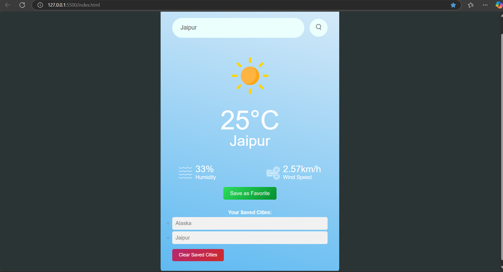

🌤 API-Based Weather App
A simple weather application that fetches real-time weather data using the OpenWeather API.

🚀 Features
1)Search by City – Enter a city name to get current weather details.
2)Weather Details – Displays temperature, humidity, wind speed, and an appropriate weather icon.
3)User-Friendly UI – Clean and responsive design with HTML, CSS, and JavaScript.
4)Error Handling – Alerts users when a city is not found or input is invalid.
5)Save Favorite Cities – Users can save frequently searched cities for quick access.

🛠 Tech Stack
Frontend: HTML, CSS, JavaScript
API: OpenWeather API

📷 Preview:

📜 License
This project is licensed under the MIT License.
